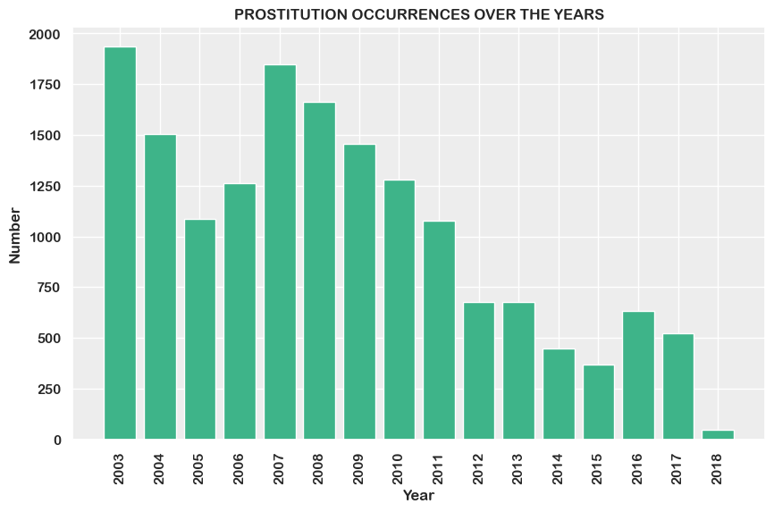
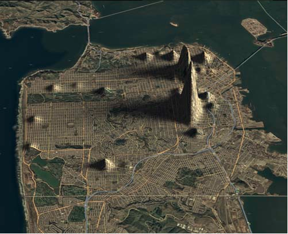

The [San Francisco Crime dataset](https://data.sfgov.org/Public-Safety/Police-Department-Incident-Reports-Historical-2003/tmnf-yvry/about_data) is a free dataset that provides valuable information about over 2 million crimes in San Francisco **from 2003 to May 2018**. Each entry in the dataset is a crime recorded by the police, indicating the category, time, and location of the crime, as well as other useful information.

For the purpose of the assignment we decided to focus on **prostitution**, to gain insights about its evolution over time and its distribution over San Francisco. From the dataset, **16.501 cases** have been recorded under the category of prostitution over the course of 15 years.

# Across the years: An overview over time

<!-- Robert Selna, Chronicle Staff Writer, wrote this in an article from 2009 on [sfgate.com](https://www.sfgate.com/crime/article/S-F-s-ambiguous-attitude-toward-brothels-3255663.php) -->
Robert Selna, Chronicle Staff Writer, wrote this in an article from 2009 on sfgate.com
>Since even before the Gold Rush, the city has been ambivalent about the sex industry. In 1849, nearly two-thirds of the 300 women in San Francisco were prostitutes, according to some estimates. And although prostitution was illegal in 1911, the city's health board ran a medical clinic for sex workers.




Today, the situation has significantly improved. As evidenced by the histogram, since 2008 the trend has dropped dramatically, reaching **523 cases in 2017**, compared to the **1937 cases in 2003**, that is more than 5 reports per day. This drastic drop is due to changes in the law, in policing strategy, law enforcement’s increased focus on human trafficking and in the way sex work is viewed by the powers that be.

What stands out is the temporary decrease in occurrences between 2004 and 2006, possibly linked to the major operation in 2005 involving 400 federal and state law enforcement officials who **dismantled 50 brothels** and other businesses in San Francisco and the Bay Area involved in the **trafficking of South Korean women forced into prostitution** 
<!-- (read the article from the New York Times [here](https://www.nytimes.com/2005/07/02/us/agents-said-to-dismantle-a-korean-sex-ring.html)). -->

It is also important to note that the number of reports classified as prostitution in this dataset likely includes cases of **loitering**, considered a crime by the California Penal Code until 2023 if associated with the intent to commit prostitution. Therefore, the number of actual prostitution cases is likely lower than what appears.

# Mapping Prostitution: Exploring Hotspots in San Francisco

**Table: Incidence of Prostitution by District**

| District    | Value |
|:-------------|:-------|
| BAYVIEW     | 136   |
| CENTRAL     | 1854  |
| INGLESIDE   | 80    |
| **MISSION**     | **7307**  |
| NORTHERN    | 3945  |
| PARK        | 18    |
| RICHMOND    | 64    |
| SOUTHERN    | 690   |
| TARAVAL     | 413   |
| TENDERLOIN  | 1994  |

It's not a surprise that almost all the prostitution incidents have been recorded in the **Mission District**, that counts **7307 occurences**, followed by Northern with 3945.
The Mission district (see map below), and particularly **Capp Street**, is notoriously famous for its high incidence of prostitution, which has even led authorities to build concrete barriers to reduce the influx of clients from outside. The barricades have significantly improved the safety of Capp. St. over the past months bringing peace and quiet. A solution that neighbors in the area deem necessary for the neighborhood's sanity and safety.
However this solution only partially solved the problem, as the sex workers were simply moved a few blocks away.

This clearly suggests that the underlying issue is not preventing clients from reaching sex workers, but rather increasing efforts to dismantle the criminal organizations that control hundreds of women, or even legalizing and regulating prostitution to remove these human lives from the streets.


<embed 
       type="text/html" 
       src="prostitution_map.html"
       width="1100"
       height="600"
       />





[Link to another page](./another-page.html).

There should be whitespace between paragraphs.

There should be whitespace between paragraphs. We recommend including a README, or a file with information about your project.


# Header 1

This is a normal paragraph following a header. GitHub is a code hosting platform for version control and collaboration. It lets you and others work together on projects from anywhere.

## Header 2

> This is a blockquote following a header.
>
> When something is important enough, you do it even if the odds are not in your favor.

### Header 3

```js
// Javascript code with syntax highlighting.
var fun = function lang(l) {
  dateformat.i18n = require('./lang/' + l)
  return true;
}
```

```ruby
# Ruby code with syntax highlighting
GitHubPages::Dependencies.gems.each do |gem, version|
  s.add_dependency(gem, "= #{version}")
end
```

#### Header 4

*   This is an unordered list following a header.
*   This is an unordered list following a header.
*   This is an unordered list following a header.

##### Header 5

1.  This is an ordered list following a header.
2.  This is an ordered list following a header.
3.  This is an ordered list following a header.

###### Header 6


### There's a horizontal rule below this.

* * *

### Here is an unordered list:

*   Item foo
*   Item bar
*   Item baz
*   Item zip

### And an ordered list:

1.  Item one
1.  Item two
1.  Item three
1.  Item four

### And a nested list:

- level 1 item
  - level 2 item
  - level 2 item
    - level 3 item
    - level 3 item
- level 1 item
  - level 2 item
  - level 2 item
  - level 2 item
- level 1 item
  - level 2 item
  - level 2 item
- level 1 item

### Small image


### Large image


### Definition lists can be used with HTML syntax.

<dl>
<dt>Name</dt>
<dd>Godzilla</dd>
<dt>Born</dt>
<dd>1952</dd>
<dt>Birthplace</dt>
<dd>Japan</dd>
<dt>Color</dt>
<dd>Green</dd>
</dl>

```
Long, single-line code blocks should not wrap. They should horizontally scroll if they are too long. This line should be long enough to demonstrate this.
```

```
The final element.
```
